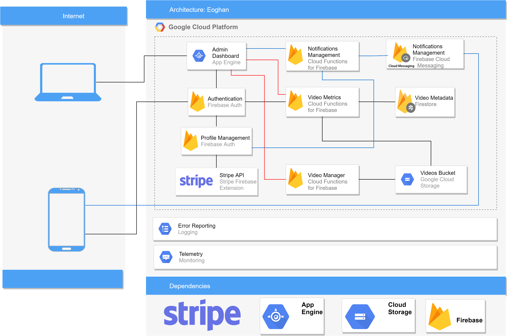

<h1 align="center">
    
  Google Cloud Backend for a Flutter Mobile App.
</h1>

This is a <b>Google Cloud</b> Backend for a <b>Flutter</b> Video sharing platform.

 

## 
🏗 Services Used

#### 🤚 Authentication

|                                                        |        Service       |                  Rationale                                                                                                                                                                                  |
| ------------------------------------------------------ | -------------------- | ----------------------------------------------------------------------------------------------------------------------------------------------------------------------------------------------------------- |
|         |    `Firebase Auth`   |  [Firebase Auth](https://firebase.google.com/docs/auth/) is strongly supported by Flutter it removes the hassle of integrating authentication services. It's ideal for Agile startups and it's widely used. |

 

#### 🙎‍♀️ User Profile Management

|                                                        |       Service     |                  Rationale                                                                                                                                                                           |
| ------------------------------------------------------ | ----------------- | ---------------------------------------------------------------------------------------------------------------------------------------------------------------------------------------------------- |
|         |  `Firebase Auth`  |  [Firebase Auth](https://firebase.google.com/docs/auth/admin/manage-users/) also provides profile management features to keep track of signed in users, last sign on etc.                            |
|        |    `Firestore`    |  [Cloud Firestore](https://firebase.google.com/docs/firestore) is a highly scalable NoSQL Database natively integrated in Firebase, it's the easiest way to store 'User generated data' on Firebase. |

 

#### 💵 Payments

|                                                        |        Service       |                  Rationale                                                                                                                                                                                                             |
| ------------------------------------------------------ | -------------------- | -------------------------------------------------------------------------------------------------------------------------------------------------------------------------------------------------------------------------------------- |
|           | `Stripe Firebase SDK`|  [Stripe Firebase SDK](https://firebase.google.com/products/extensions/stripe-firestore-stripe-payments) enables users to sign-up for your digital goods and paid content with Stripe Checkout and manage their subscriptions with the Stripe customer portal. It syncs customers' subscription status with your Cloud Firestore and adds custom claims using Firebase Authentication for convenient access control in your application. |
 

#### 📺 Video Management

|                                                        |                  Service               |                  Rationale                                                                                                                                                                                                          |
| ------------------------------------------------------ | -------------------------------------- | -------------------------------------------------------------------------------------------------------------------------------------------------------------------------------------------------------------------------------------- |
|    |         `Google Cloud Storage`         |  [Azure Data Factory](https://docs.microsoft.com/en-us/azure/data-factory/) is Azure's cloud ETL service for scale-out serverless data integration and data transformation.                                              |
|        |               `Firestore`              |  [Azure Data Factory](https://docs.microsoft.com/en-us/azure/data-factory/) is Azure's cloud ETL service for scale-out serverless data integration and data transformation.                                                            |
|  |  `Firebase Functions/ Cloud Functions` |  [Azure Data Factory](https://docs.microsoft.com/en-us/azure/data-factory/) is Azure's cloud ETL service for scale-out serverless data integration and data transformation.                              |

 

#### 👀 Admin Dashboard

|                                                        |         Service         |                  Rationale                                                                                                                                                                                                           |
| ------------------------------------------------------ | ----------------------- | -------------------------------------------------------------------------------------------------------------------------------------------------------------------------------------------------------------------------------------- |
|    |  `Google Cloud Storage` |  [Azure Data Factory](https://docs.microsoft.com/en-us/azure/data-factory/) is Azure's cloud ETL service for scale-out serverless data integration and data transformation.                                              |
|        |        `Firestore`      |  [Azure Data Factory](https://docs.microsoft.com/en-us/azure/data-factory/) is Azure's cloud ETL service for scale-out serverless data integration and data transformation.                                                            |

