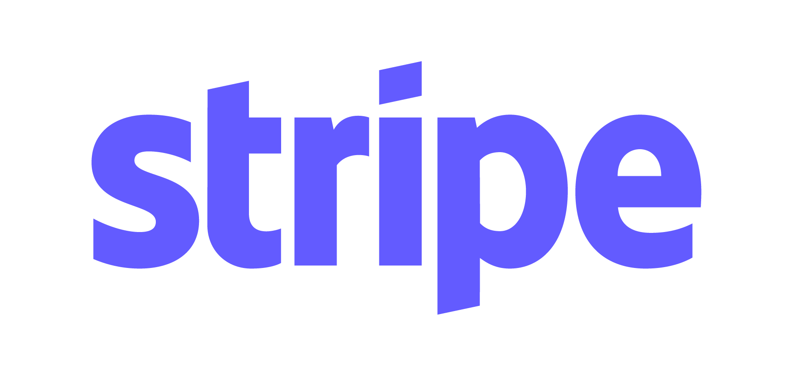

<h1 align="center">
   
  Google Cloud Backend for a Flutter Mobile App.
</h1>
 

This is a <b>Google Cloud</b> Backend Architecture for a <b>Mobile App</b> Video sharing platform.

Click <a href="https://viewer.diagrams.net/?tags=%7B%7D&highlight=0000ff&edit=_blank&layers=1&nav=1&title=Eoghan.drawio#R7X1Zd6JK1%2FCvOWt938XpxTxcgqCijM568yxERAZBBWX49e8uRJOoSae7kz59%2BnS6E6Uoqnbtee8qqv4iW9uic7B3Gy1ZudFfBLYq%2FiKlvwiC5Qj4iwrKcwFN8ucC7%2BCvzkX4U8HQr9ymEGtKj%2F7KTV9UzJIkyvzdy0IniWPXyV6U2YdDkr%2Bstk6il73ubM%2B9Kxg6dnRfOvVX2eZcytHYU3nX9b3NpWcca%2B5s7UvlpiDd2Kskf1ZEyn%2BRrUOSZOdv26LlRgh3F7ycn2u%2FcvcK2MGNs%2Fc8gP09V6iNxS13ka2twq4%2F2mB%2FU%2BS5mZMdHZsRN9Bm5QUFaz%2BKWkmUHOpLss2gf3%2BRYpodktC93ImT2EWFl1FicOEd7JUP4N3UWSdx1lAap%2BDajnwvhgsHqroH1MjOdvzYQ%2Fexpv4zAFgc%2FYNyXkb%2F4MvJPWQ%2B0ExoGsqS3VMrI3Qh%2FU1dOm4Ghj3VUN01wiCFijbZNkL9wldgqcz2YwRRXfse4Q0NUPdu8ayoIUDHTbZudiihSnOXoM9PNMLAEOz5On9iLYLhv1yqbZ5xFnPhI7vhaO%2Fa%2BhPR4UtD92%2FhAfYBDzAR9Csu4YuHvnSSxAO0EVgrSo4r%2BDQjO1snh%2B2lJvR8rfzPcVBUU%2FL35R%2BSwl4yEE3fMRDLY%2FfcQzP0J3EP%2B4h7buj%2Fks5AglX985zY%2BJUdLmoWlRySY7xyV82VvUyT6Ji5wsG5EB%2BVXq%2BID0Iy%2FVJKcYwn7rFMP5BR%2BrNElOVeFVHEk7X9uyCX2R%2BTsxSSWP3zvOgsoDIYxgM8NHB3CXA%2BSMqTFJ%2FbuwhyowYOlxI18by6%2Fg2FV3a6qemEnRkf2WJ7eRWUZ1JxowtonKPa5Bu6YIfa2BYe8i6%2BeM6O%2BLJxCwW6gNu7w%2FmLFDVgQZF9yJqeInvpRmaS%2BplfVzqcCXWVdvXm%2FtZfrRDEt9rkVjtc670Uf%2Fpe0%2FD1z42%2Besylb8vW13m34VXsy71CoKh7Tr14YQcX9Lh%2FeunsPGLfpkcz8Wt2a4B5KSh%2F4%2FyXGzWTrNepm93x%2FxXw7xcJkrxjQncFrltzCXy9SbwktiP5qfSZPkFc%2BVRHTWolj7gmcLOsbGhlH7PkJfe6hZ%2FNnn2fo6a%2B0M2VVDQt1xfl5SKGkc6eXzx7Cl0%2BPVZfPT23EpAH%2ByQOUNL2EZretidpcjw4DU5mZRffauJSmPa6iVBM%2Fezv6u8GdZl98Ny3%2BK9hEoTXN5nv3Vz0XiX4FtS%2Fj6GhSOKF%2FHAYdye8%2BENf8APszEMUUx9qZoRjtgHsgO6sNex7bUzbP7hLO0XeJmrhnsihmzmbRgh%2BpuFZXwD795qZNwXr64z7jDFJ4ssDu0LRn2BX2E%2BwKQ8RQf9uGobj2BsNw9xrGPJBvMBQXyj2dar9kJJhPlTJTPyVm8BDmpvZKzuz361m3tMpaGT4d98pUlFplhzcV3v7o7M%2BV2fR7xaF31xnXRKlbyqthjP8bZ3tfJXMyyTLku2FP0TbCb1abT2j27r%2BeTVnYqe7cxZ27ReIxcW6S%2BFSil1K4HstrKRwviTa6QmiSrEA1idaZlcnFqVILafF0akw3%2B4OMEdKTiq5IlclTWolfXK2zkkLhFxr8dVq6%2FhKd5MtO3RlxJvUntIHc9hLVt1BbvjcCZ4i1dip1C1fLkquMEYhrZLneoovEotZr7Kn%2FNEcKoUayL7SiUJ4XpvPosiJuALqUHAvd7oe9BPySiDmbkvxVtsoWmG9kythvjGyjjq0C21TuuRg2kgptKFA6CWF1deSQusjq9AkGdd9odIC5ahVDq4HTqFVHqFXMqVXYw%2FKcjXQKK2SC72ak%2FrIoaAtHGCoVt0oXYwwfzGlN%2FNtEanT3mZOZLGz5fHl1mKW2wmpSIKntQRcg099JORGqXhuB0%2BNWM%2FnUz2CceXOdlLBmInFEMZAROGq48GYtFLzqQpgQLBUhjQntZFH6lDH7kx2C2KDAQ7gvgBwe5U2kkmAHdcrr9CCsW%2F688DtyCzQDnOnRaR0B7TTGfNKPIjcrnWCkVRKQG0VcrMx8vDokFbuEovdspMzCrboWJWCWaOM7%2Fk6NR%2BlPTXWMW2Wbe1pkRq%2B3tHlnqwHCrsenvtpDelqJfXYxTZKl1ISDII5pQWiZJDY8z6qZ33Ig5FAGNLLPvTuUx8WposaNr%2FpY%2FLUx3giWoFG3vRBNH1kTjwB%2Buyi1XZyXBKD0CD01J4JD8obmBD9qzHQ%2BAYm8gyTOuvhy86YWcwW0XLLhwspC5adKH9Qfh3DIFzA79MYTCQfNd80uK%2BK%2BEKr1qjI57NBonT0dD7TK%2BANGK8A%2FG%2FxSojReosiVUkjgC%2BKpQT86mOVGrRTbSRgajDONOB1NdBTrUWV6gjuj%2FNCH42P%2BjAnta2WaSVFqyPnqJVYUbeF7rXgu5%2BXarDSapkp80pHsjBLfLW68gfndNqY3RJhvO0K6QDAM5JDJJe6Fmi4GigpyBBWw1NZqI9KHwKcLfhsUZU6mkOdSaCONHSPgPoAr4L6b74DLH6eQ%2F3CQPUlDV8FunbTNqP4EJSJF%2BqYXfG07EbxkqC8OVFsHFIDDgdO9RXP6fC7ZTwALCovMKdIIbToAJRzpF080BAAEYwaPkETlFoFEA7zUgvmAB26rrEC1%2FLRQNeSDOUIsx5QQNgqVcjeQbUBGX4JEcj9AvTSaKRUxpDCVckq4bNaSnKpDTGkl%2FAGV4SKdJVP0XOgE0CY6T6iFYISo0EXAa6sDOrhIynEmpGUZz5QQFdZKegBgGweAF%2BwPV%2BjjXIeGKNMAhxCvXmqS1qFPgG30H74%2FBraH8O1gvr5Gv2xK%2F2rcf3cGaM9TauUM81G4%2FzZGAjEe8bwMgagvY8B%2FAvgu3nz7AqekWlVmhOIVxBOAE8wFsA2wsH5e1nzkyRqN%2F3e88YdFZD2vKUC9AL4w8gaM7XkyESNlbMUYXUPck4DNxM1D525ulClNnCnfKXkvHIQB2Pnkc9hpM33wEISmN9QOq%2BxMKQooBBYobTmo5paGPBaFaJnMA1RknwhiZfPntmZpEj7OMTYW3V7m2Wsb5dkLwOKZKBFSnvmJaAJgE9DSqn7A0tYKWCNKNqQnBIs0xEoRANPZ3rgHfVgnAP%2FE1ptOUEKytB%2FqYnm6BpZ3qqWDeDoOYmsr4bBmAjghhJZXrBA9T0nRvcc0EjODSfxqTtdnZb%2BC24i4fl8SUTHVRdoFSg0wjPguwTKA6z1J7rOQTvgSiPLz%2B5frjFEt2f10SemSNf2zvdbSCLSH4ELvAaKftYP4qfiGRyX%2B5drEvqlntXH9VIojZGMdA1YcQvplse65KGGqzH8pOFqioBs1C2B1qpAJpCWAl1eazXQbtb5ukIyKFzrIwj0Rz1zKuE8vyLBB6wo5HV%2BQlBwycB94QmM5zAKx1icoHnmhQ9%2FHytT%2BBeGvY8gaOLzomX8t0t73iYleJa7ou95XoJmv%2BAPkP1pyU%2F8Y7OfdWIihafEoxOi2O%2BdeYm7qfb7KsMsOdRR06%2BSZXgwJecg6P%2BXNpD%2BZtkH%2FP0p0995Yu4hbohHYnTDqCitsHu%2FKrku72r496%2FnK6ge6nWM%2BvISBTxH3msY7lHm87PUywUNb%2BHl5fxkvvEzdwi8jO7mIG03YnvDuzc83uilWzGGOzKD%2Ft1ah3ey%2FpW835R5%2B7mofs%2BSlD8psbdSYqQ9HWA2cq5HcgnXyWIaxXbXQg5pAWF9rkseZUhhoQcCOPzzEgU6z9NhWkvIFWkMYSUEsCgElyyo79EQqOQQBBAoZaR0F5ET6ztwNaFd5JiCi9ntRQ4xKVfbiegA1ufkYAjBxW4JY3ZlfLdoR7o9ta7pJqUleIr0lNKor8%2B%2FlxDyEjIejZFXopAU3FAKxoAZkoXp8KvIGkodQJCi1PdVyYHgLESuKwnBhadD4FIHKOhfmZNQl9Iuz8K41EAgIYws4DfVUT%2BSUN%2FTW6KEgnYY90051PcpvGkRQkuHRm3oozEOuPQMCfBVWVdYwZGnNQhR9WBOKnINe6VfYR1DKGpR%2Bhkez6ocuB5fYIfQGtzyKixq%2BIYCDkEDSjNCP2MILi0IGEOs7idQYJwe0Mlp6uYocKEv%2FQCOCni2vH1Ga%2BUEBHhAU9SfAwGHkBrSGAK9S5%2BiBHWKOii94mwMbTS4kCwUggMOZQrGB8GqgEO%2F%2BaWuKsl1WqfBL4zv9lkLxjs%2F47IUMJTKOeMRjU%2FGAFekUePOqemoXXEBIT7gWUep1xqvWokCPaPB8%2B2ziIf1Mwz1sxoEncZoXF8rKEEzmj%2BDSSuBJrmBZGQoahDA4XpgNbSHflEoFIzP%2BAK8omSR0bQN%2FZJQH%2FDe9AuBsobSFSMHxq0RDf9ggPPq%2BTMoRdH0ATiaAz%2BFZMNft8%2FS6Fnt6VnEE8C%2FDe%2BNEI6ej9N6DitdB%2FiBV8uyCvKvBt6Vb29kjIZ2Ma2RGwhEcZQQaPgmRTwO%2FHaRE1uRMehLgbEqF7oTgEP6IoMjKQSZbGSiTnJoIE9hI5OiZqA0Y%2BAh3EM9r2jKpafyMfCYR5xhE4qzTrrS%2BgX%2B4B7gSy7qcaFUEMJBNb%2FoCuCb8fEMl0PdP4v4U3viMTSm5lo54zrXrnyC6DQnGznRUHIEeDu%2F8gnwqwE65Nym1fA4KleO0F9NA2iz0p50F5IHaEOmG3kHPMhXmgCsiMeLRqYBpy%2BfRaG6DrrjgtMbeEiUdLnoQdBDKNEDOBQaelkk4jFU%2FrLP5%2BWv03fqizrYrkoNlKrBOw79UU86Oi81hI8RSic6iB4IfhKlngE2lBCqdB%2FBjKZPFKyRo4uehrpKDnoE5KzmVSQTiHebscFzgYCStHTTN1VP2wTzq25ASSpt5DX84gDs4%2BLK94FCPcl7TiI9ctXXklKBrqfO%2BtEDvhee6VjUL9IVXoHwYDyNQzq3qRBnnQjlw2e4l9DUEgW8XOuItOaHBq91AhnZj0BrdOAYycPVPpzxjHSmRTf89IS7ANm9C%2B%2B8Wg6wyldbhuiiI%2F3XyOIDvGNwjRln2K%2B0ewAH9AV6stFLdbvAjxc7okoIH97FzqJ2ET8WjQ5MtZqGL9ojn%2Bwg0l23cGqIhvilvRqeqral1Sv2D55ynj1%2FYwcrBN9FdnK8HvPV3gH%2FlGhsZ96DX%2BAB7XyN8FuhaUcnv9K6pMqrPQW4kU7WkZ6p9Q2SJ6V40osK0snYhb%2B0QK6Qfbzanjo13tgCNKmAdNcTjs9puZF8sZcE8FmpN2Oy0DNwrVUXmZnDGENCQclHsFn6C%2FuiNHofpf5kpHMbG1Hrx4veRm2SKLXe2Le7Z9HkiDFSLs%2FiyAZf9BXYbmTXykbOCk2qk8gX21Q%2Fe7HnqjRH9qJobCCaVgV6a%2Ff%2By1s0byfeCGwBkl%2Fjgt%2BRVSLf8GJf4C9K2F9oV%2Btm48nmoUQ9fsZFiGwTgh9r%2FJxb3CP%2BLxu%2FGuiqlcgnveD4xl5Cv8oz2wE6Z4hkFaVhrau%2Fd6enKgS7Rze6BtEB1xpfqfaBR8hHtcAOzBGPNPwpINsGdihHiei8wVudAEcJZoA7N550E6LvpRzZmqu8Ih662n%2F%2FDk9v4Rj5BgAnsm0y6HYB0bq%2BBtwc6%2Bnzs63D0HTixU7f%2B7bzHPmJVz37UrYxRAvQaQ3f3T4r1Lxz0e8asoONjwT%2Bfw54rJ5oLNBPdgT8%2F5fPAi2Q7RYusUOlXW3FnSwAn4AfHQivyJFFoUS%2F9lgGa1xc8Kue7WTV2Hm0LADqzp%2F8DETfJ30D8FhXGBu%2BvMQqqF%2B6jkeu%2FSKdqxHn8SG9o9U8BOXID7rwEFZPC1Tzm3KEn5oviCefB9Gw4UkoQ%2FL%2F1Fc9XVjW5f7FD0U4R9OMTnWmragh%2FQbXV%2F8NLbXQkd456wmk8%2BH6Kncl4IYyGrlD8S6UFXV82PD0tQziEuPsq2K1LWliNPCDkZwRlzYAR8jmXfRWbfPBbpBn%2BAAXqP9rjAIx%2BMVfRX3VfDq%2BwI54jbr60MCnCI9PNvH2WTT5ZV38JwrZhStdwW4YyE40uhz8KBSzUBc7AXhHOMMuvnttixsdDjzx5ninvuKdl0hgvoKWrFS9tj5UTi9j9Py0uEx%2BVfnJIRex6dWzO98wwfMNyafLXewLzXEESRM8heMsQ72ce8AfvD9FfMHxB4nZT8sL3k%2FwDLODv6vXP5vK8%2Bz%2FswTWZbahmZIQUMrYW%2F4%2FnCbrGQMABbv5%2Fv%2FvpyjeM73RpMrvnr3C%2BGy5tlxkbpy%2Btdb7JgsHRMxeJjUfzjk8n6Boit47FfAoh%2Foyy%2FreNOqnsShPf7kyJwbMSn6NQznqS13xytWfw62PX7u5o%2BFPfOvm6U2b%2BV%2FPXrT5yls3Ty%2FazC%2FtfcZbN8%2Ffpnlrmf3HvU3zeOqH4m%2FnPrjL%2B4uXRs4vCDXP%2FdAM0OMXin8dHsG%2Fi0ewz%2BKRr76ZdZm4%2ByozXaY0fpF3s4jf7tUJCr95dYKn7icQH70E%2FHkTiB%2F74oR5SMCuIrOt2bHtuVs3fv8ihT%2FvaP3kFQfEf%2FGFh4fWBX%2FHPPpnry%2B4DSM4jP7CPljCxLz2ahX29EN%2BkqfG%2F1Ia%2BeubYbxN7G9bbfAq3j8J1w9fwvmQd9oOvpP%2BlFfaLqvN2sfYQVow%2FevRyrN1vW%2FEk%2Fb%2F8%2FbbP7IxxDeIxVvK%2Bt2W4tc3Co98o3%2FYKPAs84V4sOrsnzQKD9e4%2FvusAvMKzX4xq%2FAoKPoAq1C764dvtgqgleJ35RAJ7ilv%2BPL7gxxiYzcYe4tSa%2FEy3T3rEi1iq3v9GZB8p%2BV6CeAfy%2FXJluv9ovvfsFyXTO2ffYzezJa9ac2%2Bmi3DPzz3%2BmNJdPwPzb%2BX5vw7SU7%2FWhS%2Fd7P%2B5MQ%2FmOK%2FmpAzv46Qs1%2BT8rdpdxcRtNvNpOhr%2BoH4moJ4lR1%2B%2FqZ0r7gDNH8zjcZS3MtGXplGu2%2FqsiPrJVtI3Dgn5zHfNQQ0sctn1XaoQvoGyAx2AzDzJlwM%2BWP1uSZ4fJKSM8Qf6x%2Bx%2F6zmZL9HdX6ssXxd%2FL5fqZIPXKc3fawPlrdv5m3iZXKF5bC3eRXDfqg%2BjmH85zM39Y86gv9ut%2BARB%2F%2BcdRfvdQuKseHQ8XDKbod%2FY06IhUd%2BdTFfP5ni32umv1k1YRjDtFpXwt4g%2FasW%2FyHK2M8x8LfW8raJT14lQ%2F5aqdhXyfMNSyaIO5cJezAp%2BnC%2FyU9br%2FaxOVhhtfXjh%2FlFyU43y8Q%2BrF5PwN5kaoXdDlqSY8%2BPf%2B2tHOzd7n%2FuGczfLBt5lcH%2F9j4Oj32T%2BzMHQH%2Bg5bROdjy45yy9nHgblD6%2F4d4bNqQkAW%2FTb7Dhkyr7oQM%2FLozy4NCP60v6z4TlA1Te3YEcjxaUPzqQg%2FoshUfdr%2FuQ3B1YbTd2fDf9Q6qrh09cDO4%2FRqvLeSG%2FxOlL%2F7Wzc3CCeSf9%2BU%2BjP%2F51%2Bj800l69R9T%2Fznss7S5HMd2Z%2Fx9nlo%2FAO82%2FVJHM%2FULayzKJ51h%2F67yrx8aSuA3hf5apZN%2Bz%2Bjn3t5F9RjxEPBcRfOHe3b8A87Rg63NowT8wVxeufOHOcB8gAw%2BDu3eg7tnCnXev0nnP6Tr0m7iiL6dxXE4uvMMUzj6KZJgPX8nzEG%2B%2F1raAj%2FX1A2o9p8rr%2FPD2Op6HaP%2BYdTwPQfrYfQH1JPPXzZkoj5eqfMd6%2FB89zKBZy%2F%2F6loP3K3yw2yLNTVPbe%2Bs0sV8lxv2XLq75QHG6tPL7LK55OPpv8K9%2B5Y3gdkimWv5ENAY51u94iQA%2F%2BnC8kccefNPQH0lpCRp8tuxNxKTwRRQiUZvIY%2FQVX81m0E4lddHf0Qj%2B7kVUWyI2Awn1sEF39oMA%2FpYliQhR%2F6c4UyqQHJN84cy6bDJQqXhgVp6ICHJiUZW%2FCNEMjuyR5XdiH20%2F78Y7dAMbkUaVom%2BVz65RQuTcKNIL5tEtJGq7USxZFGl35nhKq3U87FmePqyscVtik82I2BQmGYhdppDVky8CVCJ%2F9LsbauXNOxJ9wqQtfVxyR2xZcahNvpiuuUwCnSVyq4rH5ywZDcwpni3h7qFlsmTfhgvAhIjLMVdWEsc47na3n6G9HLiiHXBVd9teI2%2B0XVVmVUoqGQ5UGpuhknRIsjRjTPzpNI4mJZ%2FggDmRXZlEXJDLDOtyhV%2BhEq6yDtiSJzonnlLgQTqvJB4HXXiqTuTJJ2YL1eMRCYXZYDiKNMEylvMFEFFa93oDuT129UO6dfESC4WxJZu9npEZIg8MsHKNOWN7zmiki%2Fl8sJn0vbWxsbYmGnNFqK1dVo6PlRwpxcnnzZa5JlYGe6T0vsJxXOoF9kTaascJADXXO%2BTAO%2B7bPYYe5Zti1p8lmET1mGHW3uBROJo4O6MzD%2BebFYwCK9pFODOduN8rSpYS3Nmg7HEJ723Xs3534ubBUXaI4aiM8rYYK4zCDEYM1VHiTXu26Y9EVeqvhcGy11ISn9srhdpVEcTiYIqXAd4e7KjBoqdQjL4b%2BPNYGeRtu9%2BacAthOU0YtuhmkaAeU8YMhY07aQdLLWfdKpz7%2B3BKFnuQjja%2FI6QZZ6TLOTQs6AfytD8eRJoTybV06HT3u4j0Tv4%2B7zDL4b4raZrd99vurDser2eneZsqe7qsOG0QAHENvzOXcXjJjHx57NuIHbLNvpaRoUHia1Gh5tWk7Dnr0vS7ZmuMiWxJmYOFLmvEuu%2BS0dxoTx1fokiXtrup1j0czKgznJeLEeeIZJq7HdXPjqrr%2BvvRwBytdu5qtx6sebPb37dUjrfJee8oDCg163VDO561aLId7ly3J3d3GaUOdid8ZQpKZxi1iO4sGQ%2BYNFLzuWMB7AO%2FA39lmVUianfsmeP%2BoDeZlHnIYkafn1fqRPBw8zSeyWa1jY4cwexIWQupw3opypZf7BlqUA6HOIZL69FskOAHnplymNBLYWRCJ2mFMzEg8rK9rTYjHNNSh7daw9NsxU%2FkCtvjEzsYr3BKEBeSOZZCw3cGChaGXN8jOhS%2B6c7iBGnzPiuSLazcxjbrWt1%2B7g2d%2FiJQ1cNKwIZTGME4Z9k1nlmeYi7tTUAJhDrY0MLI72%2BjQU%2FGqEGPVFN3h6pmo3hlj0%2FswtKwVTJ2eWezkjF6h1uD3gnL9U1fOuVsD%2FrVjyf4O1PaO2XIOZRqFJuWVBqHWBtw88BS6MRajjEp9KSMHVA5O7LMcNL2w1aXlFvuDqcxWqMs18OooxIvfNmUrO1unAVkS152O2bC6KMocZWw2Mh%2B1Za7WwfpJproI3ItPcrHxRWzEQ2%2FsEMP6duVH9BiW%2FKVbT5gD4ohiGNadec5nk6LXpuGWEXaxk6biMZz0nBJxVAPXcXSJkos9ueyqbFyd9M2J2HJtNRZe4DPVS9tjXemqxylWeTjvt%2ByY2EjSBIuUh6VJtN8eAwqMLhirAvtuD8ihNRvr3bSqWOtg4FPbLegnjo432sTB5qa8kN5OFGPEiFEM2egnjBDWPhTHvS46E7LzXLnVwV4goGtqeMuzY%2FJXnSS2wfa7M2Cse2F7rAz8qBegSEN3uK6QWW5pdgZ%2BOVgHiTr4QHM2qHwWqPZpE8pcoEvhgP6JJ9Wsqr2x31FIdUBOeWJnLeM4bQcTHZ7Ut5rre7C9YTVmEmUbOm2Jp02X%2FGWNGiXtBItHQHp4tYBwObC%2Ft7vxG3TTaxeRzOp3ngzcYZIN1NdY02SJu4BVvvDfmHyU4%2FRSCuHe1oYJuNkQfWVzRjaUoZ9kxcZquym2%2FF8hOdTk1%2BoE7kbTGIx54VdEiwEiqy48uBs7JAPImWhtob9SgPrtttb02TuOh0gqRGVgSXORweVyDVnGg1XviPKSngIu3S6HZYDs2DjAwIfH025fFf18U54ILVBS%2BkxbNdegUUWt3MsHCQjZH2TpCXtzKUk4y6%2F1llzt5L6i1HfrbY8v%2BqHR3kKKtDwkiGvbzYVjHQGdYA6GTNnyIjn1zEu0MreDjzPMcNsHmDTHjMdqAgHzrqn5aG%2F2XCqllYOBdTFZIE72%2FL9go1IGdAoSgN7y%2BLDXlYdWt3t0pbKpcr5eFsXd0rEzmXLnVTG3Ges%2FQi8xDbRT3tpe2iH6SQ1S6ktdndBsAJvrZ10w5nW3ZR8TuOMp63T9GR55oHhCCS7ylrIR1gajIWCOax6xqlNpiPG3m9ELFeYXZeZoeMxkAqnGCtehZQnWqP%2BaoK7FeZTDhJ8n%2BsVshnttJQvpX3o7NkQAaSA0ZDNzmFq1Q6KaG75%2FnHdLZjU4gZEYuLd9UrhWS9lnaoA76QrT%2B22BZpVlYhjbz%2FWzC5ibrHognMlOqZGuBghWYOBIXedhWG1T%2FrCLjZt2wDNNZu2HTks00Kgxt4G%2BV%2FjcARWp43P8lWWYqWd48FoAkK9moR0Zi6IpXFQyUx33EM3Pvk9HKEc03tFIXAlslZ9Xl0vFzJyU%2FZzBMFws%2BHRwGKfjPsSaW9GXaQnqY48WcjOstPK9SKiRpmvVtFu7oWDvbo3JutMWrC8uthJhRu7rnKqBCYQZbE93uXDZM8wglTYI01RNXKEl13MWFWg9laLqVYconFYQI%2BibxG2Vftqq02tI%2BaidGL0yUQYSmqqsAetN86GRyz2h7ob9mYH2ci71bo7M1h132pJprc%2FEVo7HofpwA33UigutpS07%2FJ5C3xOcTHpyvK4xdh5scE2S7UuLBbCdHEEC4c4VrTX6Xhu4VorkpepPqNVLN6IE43qO1tKLTl8RUVUx1zq2mRjZ8L4kKZMCN7nONCG47illsXmNMoFxmUOsZG30ulmSMVsewJIGwETinZObKAfWxqNpRUxMCZRktCCvT0OsYEXiqFtEavTVG4h9cJmy0M2IJjhXsvb5bwVtjs7Ti%2BHQaul8ijB1A5JlrIsajYrxuJG1tcta0r73Ly%2Fnii5l5aZsrTWKzHfCnLsVWgVEnhmWT%2FU46JXhetWt6C4xRYZffhdzgpOKz3Ha8%2B4NRFZJpRZadLVAhp5SIXCq5js6MrGEjqTnBRxf8kY5mJ6WmCDVd8EA2Di7GB98nFTaPXGbt6ToQXmxNm9nWrF8nreSddBdaBy56giQVHCeJvwGjU1clIDL0qbbXq1js8zMVcEG4gybg%2BqU3cYrZF8dI9GEIk0beeHjTvwBW9Vblr7XNTVIc0zRtitNh1S7ShWSauyN9VFw%2Blvi9lh4eda7Ja4uIkSZ6Jnxmawapd5Z12czF3qOV3yMMEWo6Ovn3b2KhjvdmoRtVxwjdV02uPifU6Ptom6WjvLaa%2Fdif2JMJEOrpKOtITrb4p%2BW1vYiUHMxlNxoHqeAbAGuc%2F2jma8Vr2et21L0cDpDaN5wex4iUvFjKOmDObM2rnVdcfK%2BOgzwbSQutpqKNoLfFf6R0TdzX4ld8N2Ct8jxp3Jw2LrITOYzI1j0u339yvtyPf2YTAgTxM1nA%2BqtEP36cSZGulu65ZStzTl8cDgw0TlpJ0eskS7NUxwdsusA40Hhd1HIZvnBkgnLHRWpuMo3HeyclbsTJzbDA15xmJMTsqZqfBin7GURYVnMyHpKevRjuGwYW8QDrzTnhieY7PFSdtVy%2B5Iz5NwyaOIBvT2wVhu1sGSP%2B3Co%2B2xC3nfD7Susuj6By8txKFFYGuzbzFxzCbLoi%2FxfgzEDfkyi4MVefQCw%2FCO1mATdsze4dTzjjGtOXqYIm6Jj4cWBbza7pk%2BXB%2FXozGeB7ugYlY532oXAK9qHUTP6cvtE19a2zXPcCbTOUUIkxExNo4KudFYhp2SM%2BRR5Qw%2FW1jkVCMpJ2AOMw3M2KbbZiDYL3ht6oIbEWwJmsnG4OeDdQhNSbUFs4PCxH1%2BqlE5C5eCuMNPvKGU5DQnhW4RHzbsSVLHOhGZs13mp8UCnuCyoDxOtqtI22kJphcTeYIskLTWkcLFj%2BWwnFezeYiV496RKk3Px4VlyOddj%2B8MeD7BNuAszyLnJFpiz6xYm1sGRuxMyiVhixQ6Eofp6aRsmUkfBSfZdJ0dI1WyutZyQmizItlFx7nnzPptC2uJiSwBQddn%2B9znqh7n2GzLOR2Gh1Y7IEezdDQ9IW40lGztuuXBPflb%2FmSyBS33Ymh%2FuutPbfPIBQMU9m%2FwtTmYGzx3OlTHnF8DGuf8FlmZEY3O7tkNSnfHCB0RIvLr74k6nMz1RsemFY%2BczHIm%2BOphqdoDpKR0bU2RGajvFKktP1sv%2Bjavxgikvjc%2BoNh0v%2B3FFjdEHJH3cLzqRbYxbPeVIB4VghyEE6wccsE42rU4teLmpRpqKwiWKkR7twRDJsktE6G%2FPYt2U3c9REmUSerng2Bm%2B6ddy4fos93ptLdiyMvhnpxwWXuJyA9oV%2B3jmPUiKphhebYr7a0cy%2FuT0u7tNZnsqnQ83I%2F3rlZgY9OmBjJRbc3cak9QPsRZxETI9sKeMxivei1mHCSHkTmQFbxTjrADSgVsRXfBKGq%2FzJL9jjBnhMUterIu5eOqK5ThXCh9e7BxXYaR2XFLwEcYLw9E3JBZQucPLcdfilW8CARabsmmtfK6yqbjjifRYMX3qIPYcvCxLw8mxzY2z3DR2e44YpfZrhoxp6E7lDoVpbeqZYjRKEqeJ2t%2F4U9GlZUB17Tm8z2zms%2BHwihVBiOuigO%2FrRuRs1Pa%2FbZyUoR4xoUUOToizZ%2B2inza7Sq9NXaU58gNXSd4V8kMvNNepS6hBEtlqu77q86u75eeN4hGLB6nEL%2FMwhZuVNiwnKXqwmAYlqL3gZQOWtZ807eUMUtFmDTLzKLDg%2FfHDFpqZQh7b7CJVsDHo85e7UTjNO%2B0SJnhxw6ojPaglTlrUeeMAfgqO94thZZYcSG4vCfG3wkHCLlFbDz2pVrJgNPH9GVJ7SEvxUs2%2FECxgFheuKpDgkrzF8MONunbx92kY6wJb6nQ4LO4HCFh8qBTtbhtvpGHQYCVWXXqOJkTLOMVEtRNR%2Bx4w74%2FcXxhtqUtPFjsCULr7T14utwaJC6LyECCc6YOcG00GpXmcE4Mu%2B6G2o46uhEYIWWspDjrgHtpL3bGcbJe7sOKT6RhEumaOos0uq1Q2ibomxOfpfb5KC3MntzOp9Tw5GmxKejQAdZ3Jyfdc%2Fy2txmj5JA03GOA73Q56ZxyP6FdFVtqGX5aJkV0VNvEFIFlbUf2Wj0u6nMnFDcsKHm7RaFPmZLOQReOLHw%2FrUdOJ5sssjGDOloGUTVRu%2B2k7Pqmx1lOsQK3uTc4GkbmHQOwj7nZwQernikzPdN0Dlg0WS2n4WYOSi0yp1WL2NhHjIgOHWbhj9mthZ%2BmrOwnA80M3CSexTK%2BqZjdsKvt1a2uYPJiLEwO2%2BHOyBd4269yBIbaZYy2GzFTD6mYdraM58WWwFiTn8UtqZ8t2f1Mapma6PTORm6lx7bb3srE2lE4oe9IG25ZzY9dzXfleNHRJx07VhfTRqcZQofM27SwqaBDpjyihKsg9gZjWj6EPc%2B73cjy4zP11Mt525dzjA8S9w%2Ffdf%2BsdQzce%2FLsP28y8naFy80sC1P%2FPFgtUf88m89xgGBoRvNjZt5vNh6td%2Be8m3p%2FsA6CJj6LasSHzmuO3MhtAHvnpKWWxH6WHOoZw19lavDVk8xW7i5KSjQp%2B79tswHDv2v28KvrIbj3M%2FV%2FbjEs%2F2i5xVdnxP9dRQrSdnGDv%2F%2FkEtGbBWQMwd%2BxN8FyD%2BbDP8uw8vdrsP%2BVE9h%2FTjL7c5LZn5PM%2Fpxk9ucksz8nmf05yezPSWZ%2FTjL7c5LZn5PM%2Fpxk9ucksz8nmf05yezPSWa%2F9Ulm3z5XwL3MQ%2BEEe%2F%2BmKs5wXy4ngjzPRbGflYvCLzsk%2FSKzPJ%2FwivDtRm04AUh%2B8N4f9WByjb3LRn8g5n%2BtrWI%2BAfM8Tf31dZZ%2FtHPMpd4nYJ27Q%2FJP3ZyLJ%2F76ho1a4cJ0Dz6M%2FUqXn7Yf3Rtn5L13N6%2FLtNFX96O7bNnyi%2BzySb1DNL%2BakX9G%2Flcy77cz0l89JvHFPM3NRKddHQ%2Ful8jenRuvt95zD%2FLJRTvwncF48Ur6e%2BfTP0QPvFAD7INJcpxiv5APjjzkqE9TBP%2FMFpQ%2FXXqfqR6Oe6F7WIL5Zu3zA7rgvYfg%2FVob%2FlLv2Mrgq6rgsfw%2FPyD1%2Ba4dL1ZG3Jv2O8GPV4fEX33ZbYAxiEe84GDo3zfI%2FGs65wN0AX4z4Y8%2FWufE4V%2FIBysO8M%2FbX%2BkdJ838dybMbyhEPNjvj2DIL8yDQOXTKIRj%2F7ajz74Z7yx7FyFi94by0RpA9vOs5KNFgN%2BznOzBuTCogb%2FTGqVo1zmc2hWvn2a9fLHB4u2is8t%2Bi9c1asvb53%2FZbSt%2B160Zvz1Ov0%2BQ3LP%2Fo5283trF6Jdbc4Z%2F2KmCHyZRl8OebmRqmCWHeqHP7yFU5wWfaTOo%2F5Bcscx7zAr2rxcs7KM2BcbOEvSsGv6mFH2vID44tuzfI2H%2F0t2WfiyPcSdJ3L0k0Q8E6a13NH6prZW%2B7cDN79y3720k3x64yWIPcvU%2F6bTN1zeu%2F8XjkO95VYl5TJafdNbmQ5AeLZT%2Bjfbo%2B3M6869jGD5QYn67Iy4f78L3nz%2Fu8COOSXmeNn%2FL2nz1OJV%2F9Pgb%2FN4E%2Fuq8gH%2FBMOolP6A02tc4Aq5up0ReZ4P3HZP0IWxC3rPJG9MZP8An9aPfes4Xjt2kNtnm6MzXDu66ewDHGPqGTX%2Fs5K7HfEz%2Bk3z8XSd34S95mP2aUvsluPWBUns4FUj8I9zK3p5Kx799yhx3cwbBt9bnyR86lA7tb5Mgv%2FKpOvLGtGTlohr%2FBw%3D%3D">here</a> to Edit this diagram

 

## 
🏗 Services Used

#### 🤚 Authentication

|                                                        |        Service       |                  Rationale                                                                                                                                                                                  |
| ------------------------------------------------------ | -------------------- | ----------------------------------------------------------------------------------------------------------------------------------------------------------------------------------------------------------- |
|         |    `Firebase Auth`   |  [Firebase Auth](https://firebase.google.com/docs/auth/) is strongly supported by Flutter it removes the hassle of integrating authentication services. It's ideal for Agile startups and it's widely used. |

 

#### 🙎‍♀️ User Profile Management

|                                                        |       Service     |                  Rationale                                                                                                                                                                           |
| ------------------------------------------------------ | ----------------- | ---------------------------------------------------------------------------------------------------------------------------------------------------------------------------------------------------- |
|         |  `Firebase Auth`  |  [Firebase Auth](https://firebase.google.com/docs/auth/admin/manage-users/) also provides profile management features to keep track of signed in users, last sign on etc.                            |
|        |    `Firestore`    |  [Cloud Firestore](https://firebase.google.com/docs/firestore) is a highly scalable NoSQL Database natively integrated in Firebase, it's the easiest way to store 'User generated data' on Firebase. |

 

#### 💵 Payments

|                                                        |        Service             |                  Rationale                                                                                                                                                                                                             |
| ------------------------------------------------------ | -------------------------- | -------------------------------------------------------------------------------------------------------------------------------------------------------------------------------------------------------------------------------------- |
|          | `Stripe Firebase Extension`|  [Stripe Firebase Extension](https://firebase.google.com/products/extensions/stripe-firestore-stripe-payments) enables users to sign-up for your digital goods and paid content with Stripe Checkout and manage their subscriptions with the Stripe customer portal. It syncs customers' subscription status with your Cloud Firestore and adds custom claims using Firebase Authentication for convenient access control in your application. |
 

#### 📺 Video Management

|                                                        |                  Service               |                  Rationale                                                                                                                                                                                                             |
| ------------------------------------------------------ | -------------------------------------- | -------------------------------------------------------------------------------------------------------------------------------------------------------------------------------------------------------------------------------------- |
|    |         `Google Cloud Storage`         |  [Google Cloud Storage](https://cloud.google.com/storage/docs) is Google Clouds' petabyte scale Blob Storage offering. It has a 99.95% availability SLA, it is highly scalable, it is supporrted by most Mobile App development tools including Exo player, Firebase and Flutter. |
|        |            `Cloud Firestore`           |  [Cloud Firestore](https://firebase.google.com/docs/firestore) is also ideal for storing Video metadata.  |
|  |     `Cloud Functions for Firebase`     |  [Cloud Functions for Firebase](https://firebase.google.com/docs/functions)  is a serverless framework that lets you automatically run backend code in response to events triggered by Firebase features and HTTPS requests. It's ideal for video preprocessing, thumbnail extraction, video compression etc. |

 

#### 👀 Admin Dashboard

|                                                        |         Service         |                  Rationale                                                                                                                                                                                                             |
| ------------------------------------------------------ | ----------------------- | -------------------------------------------------------------------------------------------------------------------------------------------------------------------------------------------------------------------------------------- |
|      |    `Google App Engine`  |  [Google App Engine](https://cloud.google.com/appengine/docs) is a fully managed, serverless platform for developing and hosting web applications at scale. It supports several popular languages, libraries, and frameworks and handles server provisioning. It's ideal for creating a Dashboard to display metrics and it integrates with all the aforementioned services. |

 

#### 🔔 Notifications Management

|                                                        |                  Service               |                  Rationale                                                                                                                                                                                                             |
| ------------------------------------------------------ | -------------------------------------- | -------------------------------------------------------------------------------------------------------------------------------------------------------------------------------------------------------------------------------------- |
|    |      `Firebase Cloud Messaging`       |  [Firebase Cloud Messaging](https://cloud.google.com/storage/docs) Firebase Cloud Messaging (FCM) offers a broad range of messaging options and capabilities, including push notifications. It's completely free, it's very reliable and it supports both IOS and Android. |
|  |    `Cloud Functions for Firebase`     |  [Cloud Functions for Firebase](https://firebase.google.com/docs/functions)  is ideal for writing custom code to initiate push notifications in response to events or based on scheduled cron jobs. |

